# Documentação do Projeto: Simulação de Jogo de Tabuleiro Estratégico com Estruturas de Dados

Este documento descreve as especificações de design, justificativas técnicas e evidências de execução para a avaliação semestral de Estrutura de Dados.

---

## 1. Resumo do Projeto e Regras do Jogo

O projeto consiste em um jogo de tabuleiro estratégico CLI (Command Line Interface) desenvolvido em Java, baseado em gestão imobiliária e inspirado no jogo Banco Imobiliário (Monopoly). O jogo suporta de 2 a 6 jogadores e possui um tabuleiro circular contendo 20 casas.

### Regras Principais do Jogo:
- **Turnos**: A cada rodada, os jogadores rolam dois dados e avançam no tabuleiro.
- **Salário**: Ao cruzar ou parar na casa de **Início**, o jogador recebe um salário configurável (padrão R$ 200,00).
- **Gestão Imobiliária**: Os jogadores podem comprar propriedades sem dono nas quais aterrissam. Se caírem em propriedades de outros jogadores, devem pagar aluguel.
- **Valorização Imobiliária (Demanda)**: O aluguel de cada imóvel valoriza progressivamente em 10% (+0.1 no multiplicador) a cada visita de outros jogadores (mesmo se o imóvel ainda não foi comprado), até o limite de 100% (+2.0 no multiplicador).
- **Imposto**: Jogadores que caem na casa de Imposto pagam 5% do seu patrimônio líquido total (saldo + valor de compra de todas as propriedades).
- **Restituição**: Jogadores que caem na casa de Restituição recebem 10% do salário do banco.
- **Prisão**: Jogadores enviados para a prisão ficam retidos e inseridos em uma fila de espera FIFO (First-In, First-Out). Para sair, podem tentar tirar dados duplos, pagar uma fiança configurável ou utilizar a habilidade do personagem Advogado. Após 3 turnos detidos, são libertados automaticamente.
- **Leilão**: Ao parar na casa de Leilão, uma propriedade sem dono aleatória é leiloada. O lance vencedor deve ser de no mínimo 50% do valor de tabela da propriedade.
- **Sorte ou Revés**: O baralho é composto por 12 cartas com efeitos positivos (ganhos e avanços) e negativos (taxas e retrocessos), gerenciado em pilha.
- **Falência**: Jogadores com saldo negativo que não possuam propriedades para vender ao banco (por 70% do valor de compra) são declarados falidos, e suas propriedades retornam ao estado de "sem dono".
- **Fim de Jogo**: A partida termina quando restar apenas um jogador ativo ou quando o limite máximo de rodadas for atingido. O ranking final é classificado de forma decrescente utilizando uma Árvore Binária de Busca (BST).

---

## 2. Justificativa da Estrutura Escolhida para Gerenciar Jogadores e Imóveis

Para gerenciar a lista de jogadores ativos e a coleção de propriedades adquiridas por cada jogador, implementamos uma estrutura de vetor dinâmico manual chamada [`DynamicArray`](file:///c:/Users/dudue/Documents/ULBRA/algoritimos/AS/src/datastructures/DynamicArray.java).

### Por que `DynamicArray`?
- **Iteração Sequencial Eficiente**: O turn-based do jogo exige iterar repetidamente sobre a lista de jogadores em ordem. O acesso aos elementos em um array dinâmico ocorre em tempo constante \(O(1)\), o que otimiza essa iteração direta.
- **Busca por Índice**: Durante a seleção de alvos, negociação de propriedades (Bônus S19) ou auditorias, precisamos acessar jogadores ou propriedades pelo seu índice de forma instantânea.
- **Inserção e Remoção Dinâmicas**: Quando um jogador vai à falência, ele é removido da lista de jogadores ativos. O `DynamicArray` gerencia essa remoção rearranjando os elementos internos em tempo linear \(O(N)\). Dado o limite máximo pequeno (6 jogadores e 40 imóveis), a complexidade de remoção é irrelevante, enquanto a simplicidade do array dinâmico garante um uso mínimo de memória e simplicidade de depuração.

### Evidências Visuais (CRUD de Configuração Pré-Jogo):

#### [S1] Cadastro de Jogador
A tela abaixo demonstra o cadastro de um jogador informando seu nome e selecionando o seu personagem e habilidade passiva correspondente.
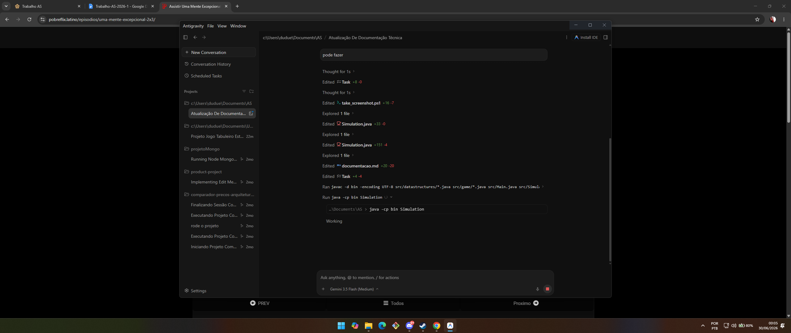

#### [S2] Listagem de Jogadores
Abaixo são listados todos os jogadores cadastrados no sistema e seus atributos iniciais antes do início da partida.
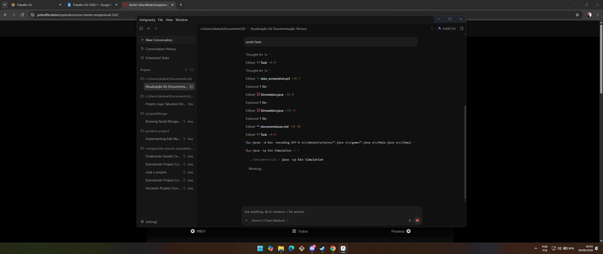

#### [S3] Cadastro de Propriedade
Cadastro de um imóvel personalizado na base do jogo, especificando nome, valor de compra e aluguel base.

#### [S4] Listagem de Propriedades
Abaixo são listadas todas as propriedades cadastradas no jogo antes do início, detalhando seus atributos de custo e aluguel inicial.
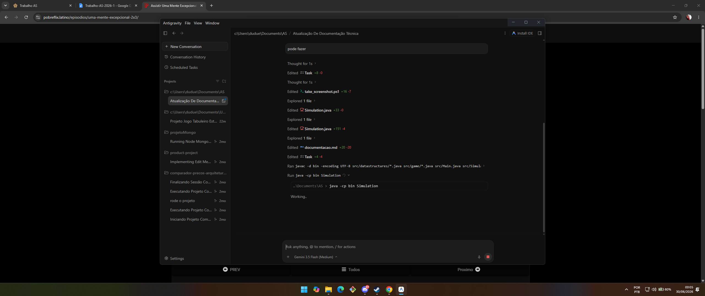

---

## 3. Adequação da Lista Duplamente Ligada Circular para o Tabuleiro

O tabuleiro do jogo é representado por uma [`CircularDoublyLinkedList`](file:///c:/Users/dudue/Documents/ULBRA/algoritimos/AS/src/datastructures/CircularDoublyLinkedList.java) composta por nós [`BoardNode`](file:///c:/Users/dudue/Documents/ULBRA/algoritimos/AS/src/game/BoardNode.java).

### Por que a Lista Duplamente Ligada Circular é a Estrutura Perfeita?
1. **Circularidade Natural (Sem Módulo)**: O tabuleiro de um jogo de tabuleiro não tem fim; ao passar da última casa, o peão deve continuar na primeira casa. Na lista circular, o ponteiro `next` da última casa aponta diretamente de volta para a primeira casa (`tail.next = head`). A navegação avança indefinitivamente sem a necessidade de cálculos de índice ou verificações de limite (ex.: `if (index >= 20)`).
2. **Movimentação Bidirecional**: Cartas de Sorte/Revés podem forçar o jogador a retroceder \(N\) casas (ex.: "Marcha Ré" ou "Erro de Rota"). Em uma lista duplamente ligada, retroceder é tão simples quanto caminhar utilizando os ponteiros `prev` (`posicaoAtual = posicaoAtual.prev`). Em uma lista encadeada simples, seria necessário recalcular a posição dando a volta completa no tabuleiro para frente, o que seria ineficiente e complexo.
3. **Casas Dinâmicas**: Permite a inserção ou remoção de imóveis durante a execução sem a necessidade de redimensionar blocos de memória contíguos (como arrays).

#### [S5] Tabuleiro Criado
Exibição das casas do tabuleiro em ordem, provando que a última casa (Mansão dos Jardins) está circularmente conectada de volta à primeira casa (Início).
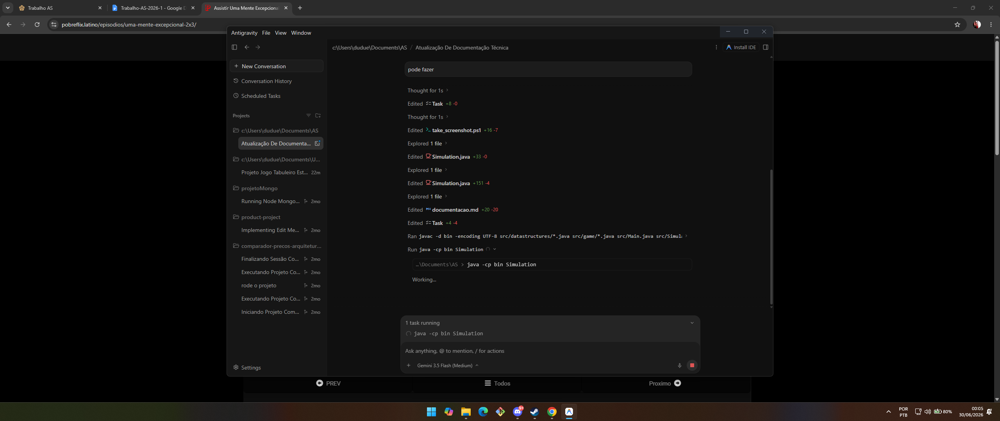

---

## 4. O Baralho de Sorte/Revés como Pilha (LIFO)

A pilha é a estrutura ideal para modelar um baralho de cartas de jogo, pois as cartas são sacadas sempre do topo (Princípio LIFO - Last-In, First-Out).

### Detalhes de Implementação da Pilha ([`Stack.java`](file:///c:/Users/dudue/Documents/ULBRA/algoritimos/AS/src/datastructures/Stack.java)):
- **Operação de Saque**: É realizada através do método `pop()`, removendo e retornando o nó do topo do baralho.
- **Descarte e Reabastecimento**: As cartas sacadas são colocadas em uma pilha secundária de descarte. Quando o baralho principal se esgota (`isEmpty()`), as cartas da pilha de descarte são retiradas, re-embaralhadas usando o algoritmo de Fisher-Yates (que permuta elementos aleatoriamente em complexidade \(O(N)\)) e reinseridas no baralho principal.

#### [S6] Carta de Sorte/Revés
Abaixo vemos a sequência de saque de uma carta de Sorte/Revés e a aplicação de seu efeito de retrocesso no jogador Bob.
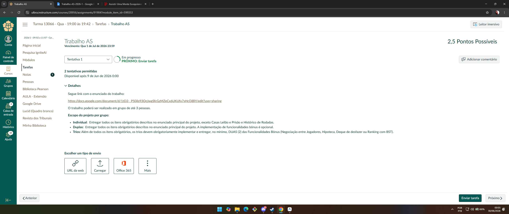

---

## 5. Modelagem de Filas (FIFO) no Jogo

A estrutura de dados Fila ([`Queue.java`](file:///c:/Users/dudue/Documents/ULBRA/algoritimos/AS/src/datastructures/Queue.java)) segue a regra de que o primeiro a entrar é o primeiro a sair (FIFO - First-In, First-Out). No projeto, ela é utilizada para duas finalidades distintas:

1. **Fila de Espera da Prisão**: Quando um jogador é enviado à prisão, ele entra no final da fila. A cada rodada, a engine processa a tentativa de saída dos prisioneiros na ordem exata de entrada (quem entrou primeiro tenta se libertar primeiro).
2. **Histórico de Rodadas (Fila de Capacidade Limitada)**: Mantém o histórico das últimas \(N\) ações (padrão 10). Ao adicionar um registro quando a fila está cheia, o elemento mais antigo (início da fila) é descartado automaticamente (`dequeue()`), mantendo uma janela deslizante estável.

#### [S7] Prisão — Entrada na Fila
Jogador sendo enviado à prisão pela carta de Sorte/Revés e sendo inserido na fila de espera.

#### [S8] Prisão — Tentativa de Saída
Abaixo vemos o jogador Carlos utilizando a sua isenção de fiança como Advogado para sair da prisão de graça e rolar os dados na mesma rodada.
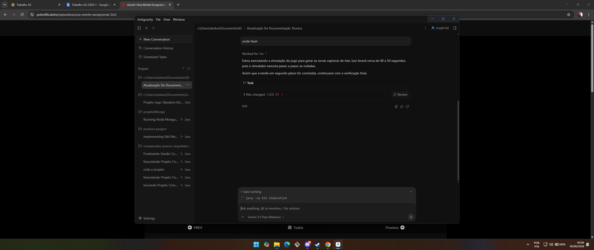

#### [S9] Histórico de Rodadas
Exibição do histórico de rodadas armazenado na fila circular, demonstrando as ações recentes dos turnos.
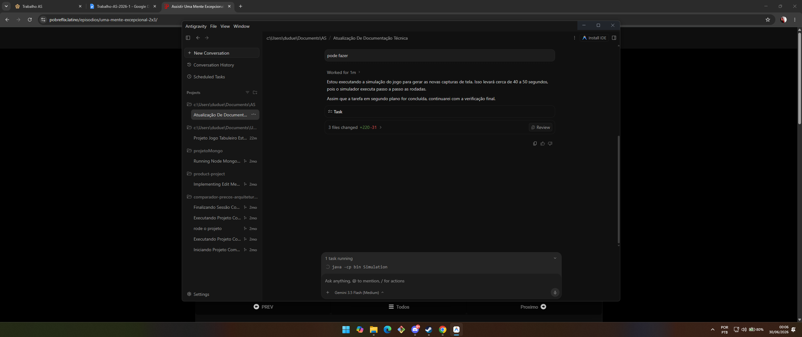

---

## 6. Integração das Habilidades Passivas dos Personagens

As habilidades passivas foram implementadas como flags e modificadores específicos na lógica central do [`GameEngine.java`](file:///c:/Users/dudue/Documents/ULBRA/algoritimos/AS/src/game/GameEngine.java), sem poluir o fluxo de controle principal.

- **Especulador**: Ao cruzar o Início, a engine verifica o tipo do jogador. Se for Especulador, multiplica o salário por 1.2. Se cair no imposto, aplica a alíquota de 5.5% sobre o patrimônio total (em vez de 5.0%).
- **Negociante**: Quando cai em um imóvel de outrem, a engine aplica o desconto: `aluguel = aluguel * 0.90`.
- **Advogado**: No menu de prisão, a opção de usar a isenção de fiança só aparece se o jogador for Advogado e a flag `isencaoFiancaUsada` for falsa.
- **Construtor**: No momento da compra de um imóvel, a base do aluguel é permanentemente redefinida para `baseRent * 1.15`.

#### [S10] Habilidade Passiva Ativa
O print exibe a passiva do Construtor aumentando o aluguel base de Barra da Tijuca em 15% e o Negociante Bob recebendo um desconto de 10% sobre o aluguel a pagar.
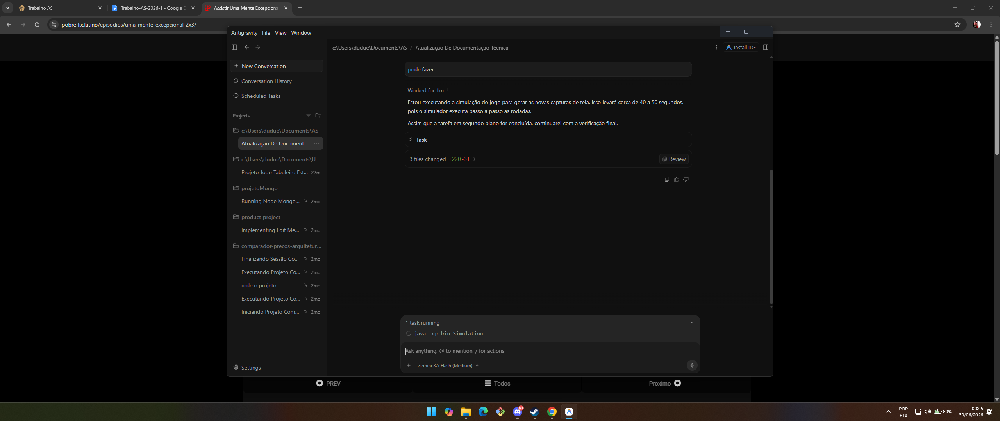

---

## 7. Passagem pelo Início vs. Retrocesso

- **Avanço**: O sistema simula o movimento do peão de casa em casa pelo tabuleiro utilizando `posicaoAtual = posicaoAtual.next`. Se, ao longo desse laço de movimentação, o nó de destino ou qualquer nó intermediário corresponder à casa do **Início**, o jogador completa uma volta, incrementa seu contador de voltas e recebe o salário base de rodada.
- **Retrocesso**: Quando o jogador volta casas devido a uma carta de Sorte/Revés, o peão move-se no sentido anti-horário utilizando `posicaoAtual = posicaoAtual.prev`. A engine desativa explicitamente qualquer verificação de bônus de salário nesse trajeto de ré, impedindo fraudes ou vantagens indevidas.

#### [S11] Passagem pelo Início
Jogador avançando no tabuleiro e recebendo o bônus salarial de Especulador ao cruzar a casa Início.
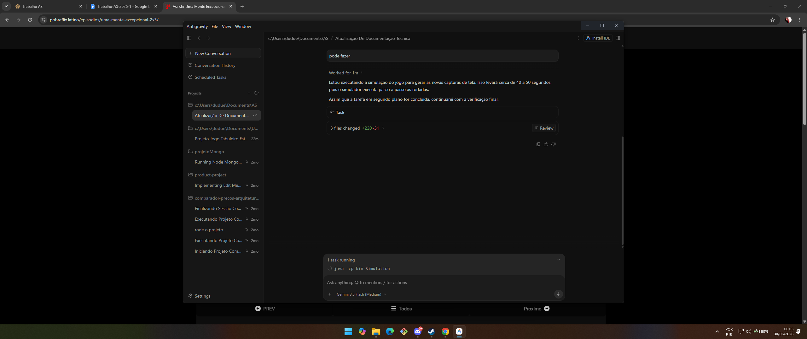

#### [S12] Retrocesso passando pelo Início
Jogador retrocedendo casas pela carta "Erro de Rota" e cruzando a casa Início de marcha ré sem receber salário.
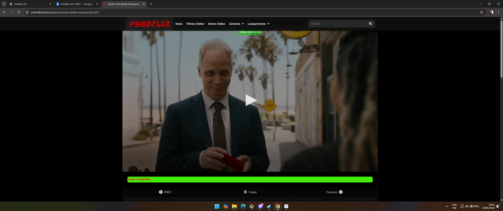

---

## 8. Funcionalidades Obrigatórias Adicionais

#### [S13] Compra de Propriedade
Exibe a decisão de compra de propriedade ao parar em uma casa sem dono, debitando o valor e registrando o imóvel.
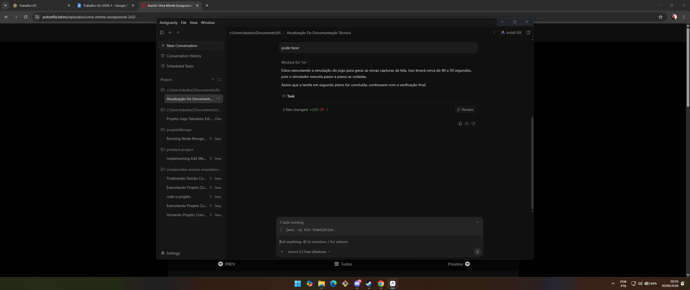

#### [S14] Pagamento de Aluguel
Transação financeira entre jogadores com multiplicador de demanda acumulado visível.

#### [S15] Leilão
O processo interativo de lances entre os jogadores por um imóvel sem proprietário e a definição do comprador vencedor.
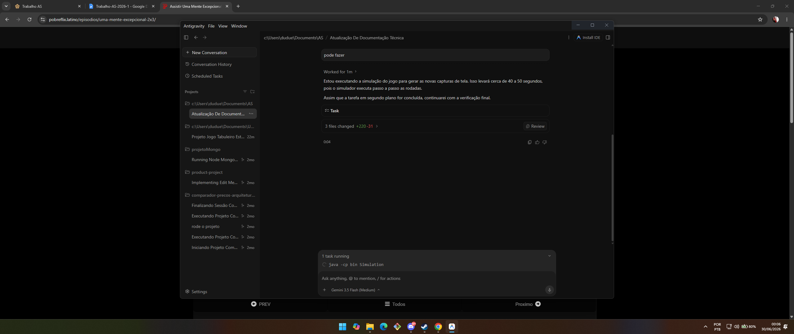

#### [S16] Falência
O jogador Bob sendo declarado falido após ficar com saldo negativo e não possuir propriedades para vender. Seus imóveis são liberados para o pool comum.
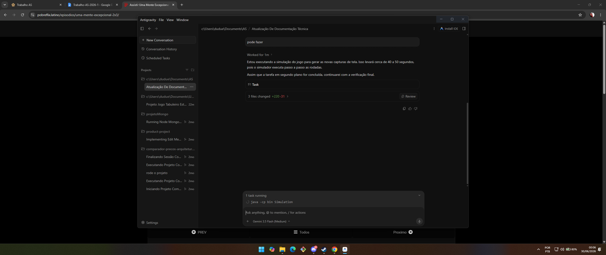

#### [S17] Encerramento da Partida
Tela de fim de jogo exibindo o relatório final contendo classificação dos jogadores por patrimônio líquido, estatísticas e histórico de rodadas.

---

## 9. Funcionalidades de Bônus Implementadas

#### [S18] Ranking com Árvore Binária de Busca (BST)
No encerramento da partida, todos os jogadores são inseridos em uma Árvore Binária de Busca ([`BST.java`](file:///c:/Users/dudue/Documents/ULBRA/algoritimos/AS/src/datastructures/BST.java)) cuja chave de comparação é o patrimônio total de cada um. O percurso in-order decrescente (Direita -> Raiz -> Esquerda) gera o ranking final. A estrutura hierárquica da árvore é exibida em formato ASCII provando o uso real da BST.
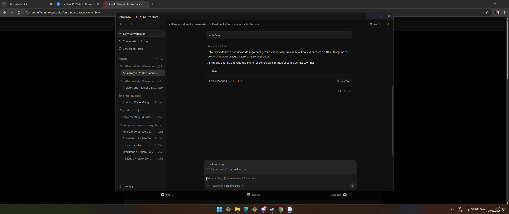

#### [S19] Negociação entre Jogadores (Troca Comercial)
Permite a proposta de trocas comerciais voluntárias de dinheiro e propriedades entre os jogadores.
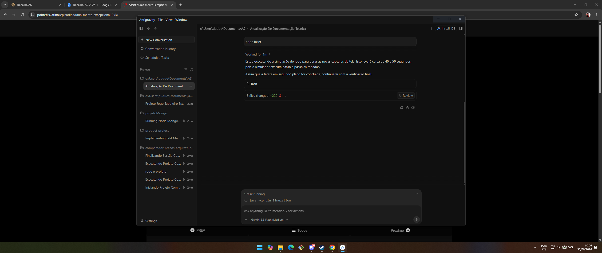

#### [S20] Hipoteca de Imóveis
Possibilidade de hipotecar um imóvel para obter 50% de seu valor de compra. Imóveis hipotecados têm aluguel zerado temporariamente. O proprietário pode quitar a hipoteca posteriormente pagando o valor mais 10% de juros.
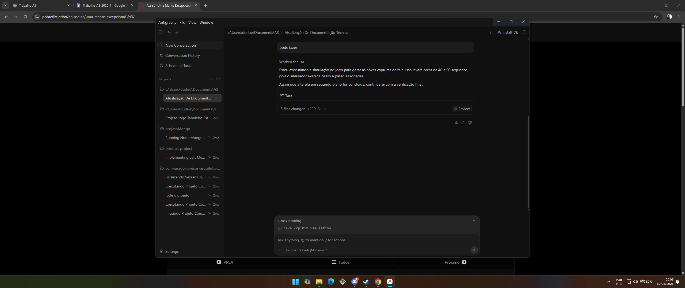
